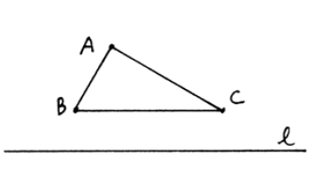
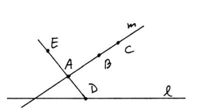
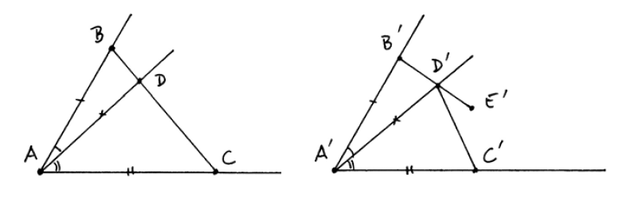

<head>
  <meta charset="utf-8">
  <meta http-equiv="x-ua-compatible" content="ie=edge">
  <meta name="viewport" content="width=device-width">
  <title>MathJax v3 with TeX input and HTML output</title>
  
  
  
</head>
<body>
    
    <h2>Notations</h2>
    

        $AB$ : segment $A$ $B$
    

    

        $A*B*C$ : $B$ is between $A$ and $C$
    

    

      $AB≅A'B'$ : segment $A$ $B$ is congruent to segment $A'$ $B'$
     

     

      $∠ABC≅∠A'B'C'$ : angle $A$ $B$ $C$ is congruent to angle $A'$ $B'$ $C'$
      

      

       $ΔABC$ : triangle $A$ $B$ $C$
      

      

   $ΔABC≅ΔA'B'C'$ : triangle $A$ $B$ $C$ is congruent to triangle $A'$ $B'$ $C'$
      

    <h2>Pasch's axiom B4</h2>
    

      This axiom says that if a line enters a triangle in one side, it must exit in one of the two other sides, but not both. As in the figure, $A$, $B$ and $C$ are not on $l$           and $l$ intersects with segment $AB$, so it should intersect with either $AC$ or $BC$.
    

    

    <h2>lemma two_pt_between</h2>

    

      This lemma asserts the existence of a point between two distinct points, using Pasch's. Given two distinct points $A$ and $B$, we find another point $C$ such that they are         noncollinear. Then we extend $A$ and $C$ to $D$, $B$ and $D$ to $E$ and use Pasch's on points $A$ $B$ $D$ and line $CE$.
    

    

      First, we need to prove that the three points are not on line $CE$. This is not as easy as it looks on the graph, which involves a series of collinearity arguments. Then as       line $CE$ intersects $AD$ at $C$, Pasch's says it either intersects $AB$ or $BD$. The first case is exactly what we want, and the second case leads to a contradiction: if         they intersect at $P$, which is also the intersection of line $CE$ and line $BD$ that is supposed to be $E$. By uniqueness, $P = E$ but $B*P*D$ and $B*D*E$, contradiction by        our axioms.
    

    
    
    <h2>lemma same_side_line_trans</h2>
    
    

      This lemma proves the transitivity of the relation two points being on the same side to a line. The proof is divided into two parts, when the three points are collinear and       the converse. The noncollinear case is proven in same_side_line_trans_noncol and we will need it for the collinear case. This case is easily done by Pasch's. $A$ $B$ $C$ are noncollinear and not on $l$. Also, we have $l$ not intersecting $AB$ and $BC$ and want to prove it doesn't intersect $AC$. If it does, Pasch says $l$ must intersect with either $AB$ or $BC$, which is contradictive.
    

    
  
    

      Proof when they are collinear involves contruction of three noncollinear points to apply the noncollinear case. Assume $A$ $B$ $C$ all lie on $m$. $m$ intersects with $l$ in       at most one point, so there must exist $D$ on $l$ but not on $m$. Then extend $D$ $A$ to get $E$. Now $A$ and $E$ are on the same side to $l$ since line $AE$ already       intersects with $l$ at $D$, which is not on segment $AE$. Also note that $A$ $B$ $E$ must be noncollinear and $A$ $B$ are on the same side to $l$. By the noncollinear case, $B$ $E$ are on the same side. Also $B$ $C$ $E$ are noncollinear and $B$ $C$ are on the same side. Again by the noncollinear case, $C$ $E$ are on the same side. Lastly, $A$ $C$ $E$ are noncollinear and $A$ $E$ are on the same side as proven before, $A$ $C$ are on the same side.
    

  
  
  <h2>theorem crossbar</h2>
  
  

    This theorem states that the ray $AD$ inside $∠BAC$ must meet $BC$.
    
  

  
  

    We prove it based on Pasch's and some sidedness reasoning. First, extend $C$ $A$ to $E$. Applying Pasch's on line $AD$ and points $E$ $B$ $C$, we know $AD$ intersects with either $BE$ or $BC$. The proof is then divided into the following steps.
 <ol>
  <li>$BE$ doesn't intersect with ray $AD$.</li>
  <li>$BE$ doesn't intersect with the opposite ray of $AD$, so $BE$ doesn't intersect with line $AD$ so line $AD$ will meet $BC$.</li>
  <li>$BC$ doesn't meet the opposite ray of $AD$, so it must meet ray $AD$.</li>
</ol>
  

  
 

  1. All points on ray $AD$ except for $A$ are on the same side with $C$ to line $AB$. All points on $BE$ except for $B$ are on the same side with $E$. However, $C$ and $E$ are on different side to $AB$, so $BE$ cannot intersect with ray $AD$.
 

 

  2. All points on opposite ray of $AD$ except for $A$ are on different side with $D$ to line $AC$. All points on $BE$ except for $E$ are on the same side with $B$ to line $AC$. Also, $B$ and $D$ are on the same side to $AC$ as $D$ is inside $∠BAC$. So $BE$ cannot intersect with the opposite ray of $AD$.
 

 

  3. All points on opposite ray of $AD$ except for $A$ are on different side with $D$ to line $AC$. All points on $BC$ except for $C$ are on the same side with $B$ to line $AC$. So $BC$ cannot intersect with the opposite ray of $AD$.
  

  
  <h2>lemma supplementary_congr </h2>
  
  

  This lemma proves that the two supplementary angles of a pair of congruent angles are also congruent. As in the figure, $D*A*C$ and $D'*A'*C'$ and we can assume that $AB$ ≅ $A'B'$, $AC$ ≅ $A'C'$ and $AD$ ≅ $A'D'$. Given $∠BAC≅∠B'A'C'$, we want to prove $∠BAD≅∠B'A'D'$. The proof is divided into three steps.
  

  
   <ol>
  <li>By SAS, we have $ΔABC≅ΔA'B'C'$ as $∠BAC≅∠B'A'C'$ and $AB ≅ A'B'$, $AC ≅ A'C'$.</li>
  <li>$CD ≅ C'D'$ as $AC ≅ A'C'$, $AD ≅ A'D'$ and $D*A*C$ and $D'*A'*C'$. Also, $ΔABC≅ΔA'B'C'$ implies $BC≅B'C'$ and $∠ACB≅∠A'C'B'$ (equivalently, $∠BCD≅∠B'C'D'$), so  $ΔCBD≅ΔC'B'D'$ by SAS.</li>
  <li>Using SAS again, $ΔDAB≅ΔD'A'B'$ : $AD ≅ A'D'$, by $ΔCBD≅ΔC'B'D'$ $BD ≅ B'D'$ and $ΔBDA≅ΔB'D'A'$ (equivalently, $ΔBDC≅ΔB'D'C'$). Then we immediately have $∠BAD≅∠B'A'D'$.</li>
  </ol>
  
  
  
  <h2>lemma congr_ang_add</h2>
  
  

  Unlike segments, we don't have that angle congruence repsects addition as an axiom, because this is a result by C6 which is SAS. First, without the loss of generality, we assume $D$ lies on $BC$ with crossbar theorem. Also, we can assume that $AB$ ≅ $A'B'$, $AC$ ≅ $A'C'$ and $AD$ ≅ $A'D'$.
  

  
  

  By SAS, we know that $ΔABD≅ΔA'B'D'$ and $ΔACD≅ΔA'C'D'$. Note that we don't know if $D'$ is on $B'C'$ as in the figure. We prove it by extending $B'$ $D'$ to $E'$ and prove $D'$ $C'$ and $E'$ are collinear. $ΔABD≅ΔA'B'D'$ implies that $∠ADB$ is congruent to $∠A'D'B'$ and so are their supplementary angles, namely $∠ADC$ and $∠A'D'E'$. Also, $ΔACD≅ΔA'C'D'$ implies $∠ADC≅∠A'D'C'$ and by transitivity $∠A'D'E'≅∠A'D'C'$. As $C'$ and $E'$ lie on the same side to line $A'D'$, they are on the same side to $D'$ by uniqueness, which implies collinearity.
  

  

  To prove $∠ABC≅∠A'B'C'$, we use SAS on $ΔABC≅ΔA'B'C'$. $AB$ ≅ $A'B'$ and $∠ABC≅∠A'B'C'$ so we are left with $BC$ ≅ $B'C'$. $BD$ ≅ $B'D'$, $CD$ ≅ $C'D'$ and $B*D*C$, $B'*D'*C'$ so by C3 $BC$ ≅ $B'C'$. 
  

  
  <h2> theorem SSS </h2>
  
  

  We prove SSS congruence using SAS congruence and the isosceles theorem. Suppose we have two triangles $ΔABC$ and $ΔA'B'C'$ and their corresponding sides are congruent. Using axioms C1 and C4, we find a point $D$ on different side of $B$ to line $AC$ such that $AB≅AD$ and $∠BAC≅∠DAC$. By SAS, it is easy to prove that $ΔADC≅ΔA'B'C'$ and by transitivity, we are left with $ΔABC≅ΔADC$. Also, $AB≅AD$ and $BC≅DC$ so by SAS, it suffices to prove that $∠ABC≅∠ADC$. $B$ and $D$ are on different side to line $AC$ so $BD$ intersects with line $AC$. Depending ono the position of intersection (in the opposite ray of $AC$, at $A$, in $AC$, at $C$, or in the opposite ray of $CA$), we have the following three cases by symmetry.
  

  
  

  By isoscles theorem, $AB≅AD$ implies $∠ABD≅∠ADB$ and $BC≅DC$ implies $∠CBD≅∠CDB$, which proves $∠ABC≅∠ADC$. In the first case, this is by congr_ang_sub. The second case is obvious and the last case is by congr_ang_add.
  

  
  <h2>Things to be done</h2>
  
  

  
  Many propositions in Elements are still not provable and we need additional axioms and theory of area to work out the rest.

0) Playfair axiom
  This axiom asserts, given a line, the existence of the unique parallel line passing through a fixed point. Most results of Book IV involves this axiom.

1) Circle intersection axiom
  This axiom ensures that two circles meet if one of them contains both points inside the other and outside. You can see this axiom showing up from Book I to IV. This axiom also makes ruler and compass construction formalizable. I am struggling to prove that angles are not trisectable. Although it's just an easy result in field theory, this method seems hard to apply here since we don't have coordinates.

2) Theory of area
  We can define an equivalence relation between rectilinear figures, intuitionally, if they have the same area. This is a useful tool dealing with some propositions in Book III.

In addition, we can add more axioms. Though not directly related to Elements, they gradually complete our axiomatic system to our intuition of real plane. For example,

3) Archimedes' axiom
  Similar to Archimedean property, the axiom says given two segments $s_1$ and $s_2$, we can always find a natural number $n$ such that $n$ copies of $s_1$ is greater than $s_2$.

4) Dedekind's axiom
  Suppose points of a line are divided into two nonempty parts $S$ and $T$ such that no points in $S$ lie between points in $T$ and no points in $T$ lie between points in $S$. Then there exists a unique point such that for all $A\in S$, $B\in T$, either $A=P$ or $B=P$ or $P$ is between $A$ and $B$. You may spot its similarity to dedekind cut. Indeed, this axiom "completes" the system such that it is isomorphic to the real plane!

5) We can define segment and angle arithmetic by taking quotient to segment and angle congruence and then define addition and multiplication on the equivalence classes. Similarity as well as many complicated geometry problems in high school competition is then formalizable.
  
  

  
</body>
