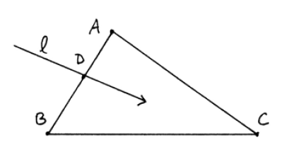
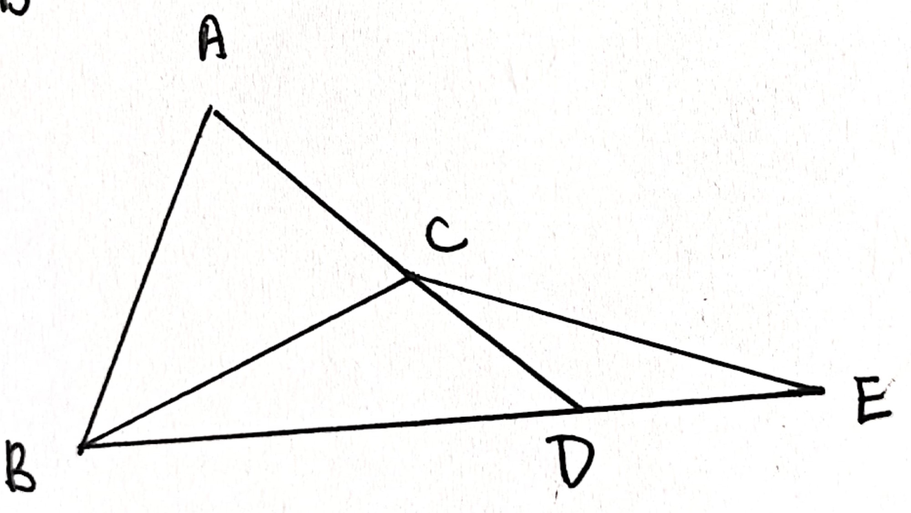
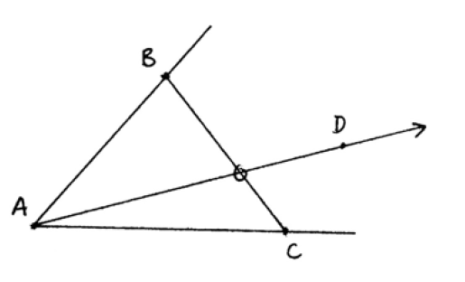
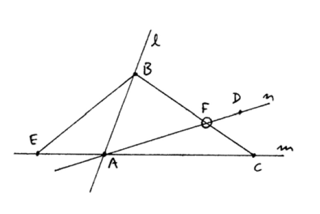

<head>
  <meta charset="utf-8">
  <meta http-equiv="x-ua-compatible" content="ie=edge">
  <meta name="viewport" content="width=device-width">
  <title>MathJax v3 with TeX input and HTML output</title>
  
  
  
</head>
<body>
    
    <h2>Notations</h2>
    

        $AB$ : segment $A$ $B$
    

    

        $A*B*C$ : $B$ is between $A$ and $C$
    

    

      $AB≅A'B'$ : segment $A$ $B$ is congruent to segment $A'$ $B'$
     

     

      $∠ABC≅∠A'B'C'$ : angle $A$ $B$ $C$ is congruent to angle $A'$ $B'$ $C'$
      

      

       $ΔABC$ : triangle $A$ $B$ $C$
      

      

   $ΔABC≅ΔA'B'C'$ : triangle $A$ $B$ $C$ is congruent to triangle $A'$ $B'$ $C'$
      

    <h2>Pasch's axiom B4</h2>
    

      This axiom says that if a line enters a triangle in one side, it must exit in one of the two other sides, but not both. As in the figure, $A$, $B$ and $C$ are not on $l$           and $l$ intersects with segment $AB$, so it should intersect with either $AC$ or $BC$.
    

    

    <h2>lemma two_pt_between</h2>

    

      This lemma asserts the existence of a point between two distinct points, using Pasch's. Given two distinct points $A$ and $B$, we find another point $C$ such that they are         noncollinear. Then we extend $A$ and $C$ to $D$, $B$ and $D$ to $E$ and use Pasch's on points $A$ $B$ $D$ and line $CE$.
    

    

      First, we need to prove that the three points are not on line $CE$. This is not as easy as it looks on the graph, which involves a series of collinearity arguments. Then as       line $CE$ intersects $AD$ at $C$, Pasch's says it either intersects $AB$ or $BD$. The first case is exactly what we want, and the second case leads to a contradiction: if         they intersect at $P$, which is also the intersection of line $CE$ and line $BD$ that is supposed to be $E$. By uniqueness, $P = E$ but $B*P*D$ and $B*D*E$, contradiction by        our axioms.
    

    
    
    <h2>lemma same_side_line_trans</h2>
    
    

      This lemma proves the transitivity of the relation two points being on the same side to a line. The proof is divided into two parts, when the three points are collinear and       the converse. The noncollinear case is proven in same_side_line_trans_noncol and we will need it for the collinear case. This case is easily done by Pasch's. $A$ $B$ $C$ are noncollinear and not on $l$. Also, we have $l$ not intersecting $AB$ and $BC$ and want to prove it doesn't intersect $AC$. If it does, Pasch says $l$ must intersect with either $AB$ or $BC$, which is contradictive.
    

    
  
    

      Proof when they are collinear involves contruction of three noncollinear points to apply the noncollinear case. Assume $A$ $B$ $C$ all lie on $m$. $m$ intersects with $l$ in       at most one point, so there must exist $D$ on $l$ but not on $m$. Then extend $D$ $A$ to get $E$. Now $A$ and $E$ are on the same side to $l$ since line $AE$ already       intersects with $l$ at $D$, which is not on segment $AE$. Also note that $A$ $B$ $E$ must be noncollinear and $A$ $B$ are on the same side to $l$. By the noncollinear case, $B$ $E$ are on the same side. Also $B$ $C$ $E$ are noncollinear and $B$ $C$ are on the same side. Again by the noncollinear case, $C$ $E$ are on the same side. Lastly, $A$ $C$ $E$ are noncollinear and $A$ $E$ are on the same side as proven before, $A$ $C$ are on the same side.
    

  
  
  <h2>theorem crossbar</h2>
  
  

    This theorem states that the ray $AD$ inside $∠BAC$ must meet $BC$. We prove it based on Pasch's and some sidedness reasoning.
    
  

  
  

    First, we extend $C$ $A$ to $E$. Apply Pasch's on line $AD$ and points $E$ $B$ $C$ and we know $AD$ intersect with either $BE$ or $BC$. The proof is divided into the following steps.
 <ol>
  <li>$BE$ doesn't intersect with ray $AD$.</li>
  <li>$BE$ doesn't intersect with the opposite ray of $AD$, so $BE$ doesn't intersect with line $AD$ so line $AD$ will meet $BC$.</li>
  <li>$BC$ doesn't meet the opposite ray of $AD$, so it must meet ray $AD$.</li>
</ol>
  

  
 

  1. All points on ray $AD$ except for $A$ are on the same side with $C$ to line $AB$. All points on $BE$ except for $B$ are on the same side with $E$. However, $C$ and $E$ are on different side to $AB$, so $BE$ cannot intersect with ray $AD$.
 

 

  2. All points on opposite ray of $AD$ except for $A$ are on different side with $D$ to line $AC$. All points on $BE$ except for $E$ are on the same side with $B$ to line $AC$. Also, $B$ and $D$ are on the same side to $AC$ as $D$ is inside $∠BAC$. So $BE$ cannot intersect with the opposite ray of $AD$.
 

 

  3. Similar to step. All points on opposite ray of $AD$ except for $A$ are on different side with $D$ to line $AC$. All points on $BC$ except for $C$ are on the same side with $B$ to line $AC$. So $BC$ cannot intersect with the opposite ray of $AD$.
  

  
  <h2>lemma congr_ang_add</h2>
  
  

  Unlike segments, we don't have that angle congruence repsects addition as an axiom, because this is a result by C6 which is SAS. First, without the loss of generality, we assume $D$ lies on $BC$ with crossbar theorem. Also, we can assume that $AB$ ≅ $A'B'$, $AC$ ≅ $A'C'$ and $AD$ ≅ $A'D'$.
  

  
  

  By SAS, we know that $ΔABD≅ΔA'B'D'$ and $ΔACD≅ΔA'C'D'$. Note that we don't know if $D'$ is on $B'C'$ as in the figure. We prove it by extending $B'$ $D'$ to $E'$ and prove $D'$ $C'$ and $E'$ are collinear. $ΔABD≅ΔA'B'D'$ implies that $∠ADB$ is congruent to $∠A'D'B'$ and so are their supplementary angles, namely $∠ADC$ and $∠A'D'E'$. Also, $ΔACD≅ΔA'C'D'$ implies $∠ADC≅∠A'D'C'$ and by transitivity $∠A'D'E'≅∠A'D'C'$. As $C'$ and $E'$ lie on the same side to line $A'D'$, they are on the same side to $D'$ by uniqueness, which implies collinearity.
  

  

  To prove $∠ABC≅∠A'B'C'$, we use SAS on $ΔABC≅ΔA'B'C'$. $AB$ ≅ $A'B'$ and $∠ABC≅∠A'B'C'$ so we are left with $BC$ ≅ $B'C'$. $BD$ ≅ $B'D'$, $CD$ ≅ $C'D'$ and $B*D*C$, $B'*D'*C'$ so by C3 $BC$ ≅ $B'C'$. 
  

</body>
